# Diagrammes PlantUML — Simulateur de CPU avec Assembleur
## Projet CPO — « Carré Petit Utile »

Ce fichier regroupe l'ensemble des prompts PlantUML permettant de générer les diagrammes UML du projet. Chaque diagramme est précédé d'une courte explication de son rôle et de ce qu'il montre.

---

## Diagramme 1 — Cas d'utilisation (Use Case)

Ce diagramme représente les fonctionnalités offertes par le système du point de vue de ses utilisateurs. On identifie deux acteurs : l'**Utilisateur** (développeur qui écrit et exécute des programmes), et le **Système** (le simulateur CPU + l'assembleur). Ce diagramme permet de valider que toutes les exigences fonctionnelles sont bien couvertes.

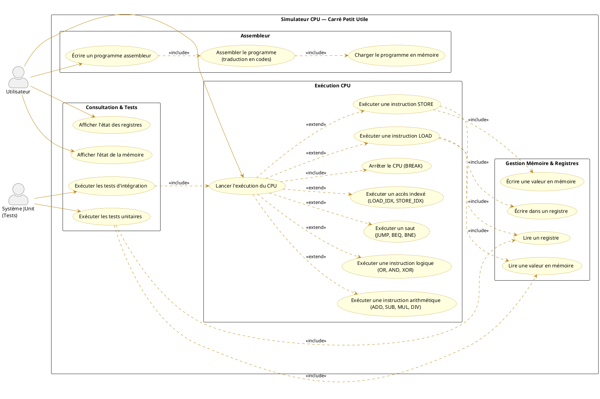

---

## Diagramme 2 — Diagramme de classes

Ce diagramme montre la structure statique complète de l'application : les classes, leurs attributs, leurs méthodes, et les relations qui les unissent. C'est la pièce maîtresse de la conception orientée objet — il doit refléter fidèlement le code Java produit.

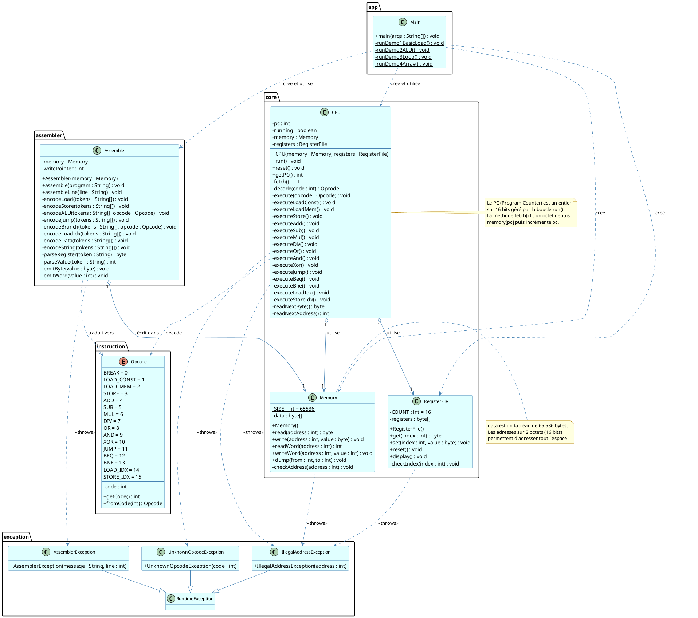

---

## Diagramme 3 — Séquence système : Exécution d'un programme

Ce diagramme de séquence **système** montre les interactions entre l'utilisateur et le système vu comme une boîte noire. Il se concentre sur *quoi* l'utilisateur demande, sans entrer dans les détails d'implémentation. C'est le premier niveau d'analyse.

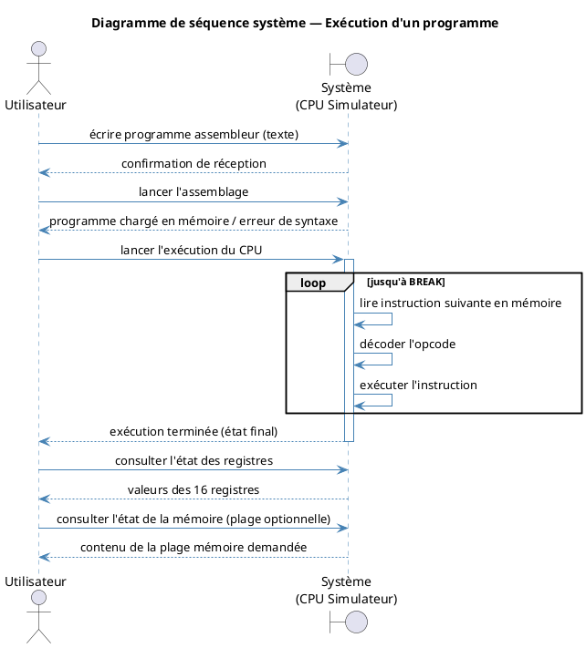

---

## Diagramme 4 — Séquence système : Assemblage d'un programme

Ce diagramme se concentre sur la phase d'assemblage vue de l'extérieur, en montrant les échanges entre l'utilisateur et le sous-système assembleur. Il complète le diagramme précédent en détaillant spécifiquement ce que l'assembleur offre comme service.

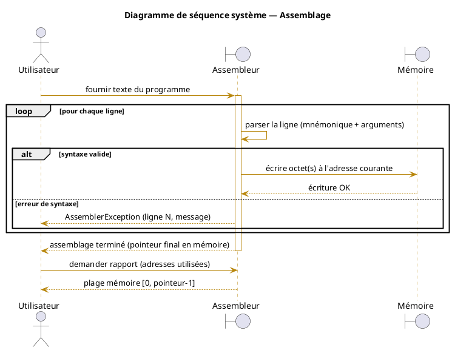

---

## Diagramme 5 — Séquence détaillée : Cycle Fetch/Decode/Execute du CPU

Ce diagramme est le plus important pour comprendre le fonctionnement interne du simulateur. Il montre, pas à pas, comment le CPU interagit avec la mémoire et le fichier de registres lors de l'exécution d'une instruction `ADD r2, r0, r1`. Il illustre parfaitement le cycle classique d'un processeur.

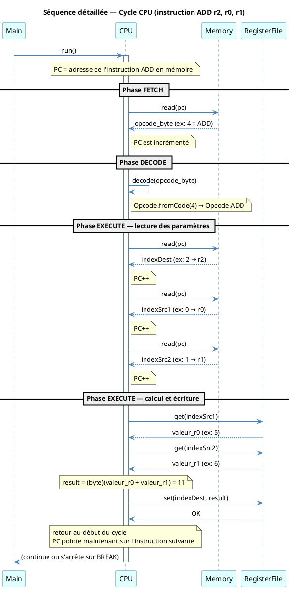

---

## Diagramme 6 — Séquence détaillée : Traduction d'une ligne par l'assembleur

Ce diagramme illustre en détail comment l'assembleur traite une ligne de code assembleur, ici `load r2, @100`, qui correspond à un chargement depuis la mémoire (LOAD_MEM). On voit comment la valeur d'adresse sur 16 bits est décomposée en deux octets.

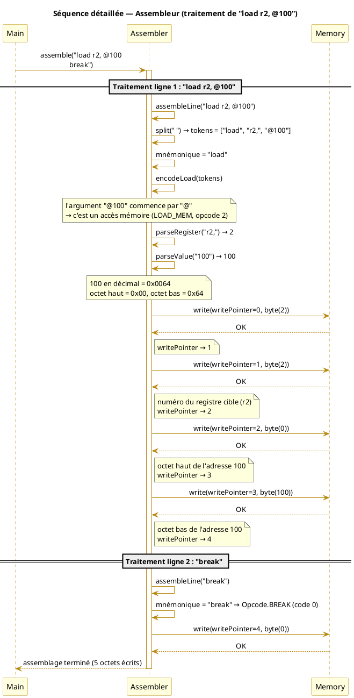

---

## Diagramme 7 — Séquence détaillée : Instruction STORE

Ce diagramme montre l'exécution d'une instruction `store r0, @101`, illustrant comment le CPU lit le numéro de registre et l'adresse de destination, récupère la valeur dans le registre, puis l'écrit en mémoire.

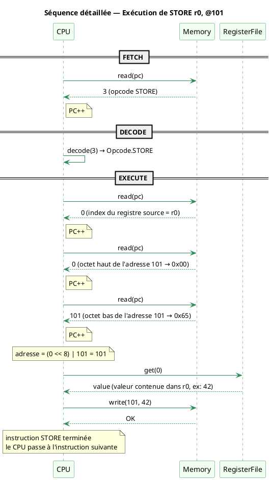

---

## Diagramme 8 — Séquence détaillée : Instruction BEQ (saut conditionnel)

Ce diagramme illustre le mécanisme de saut conditionnel, fondamental pour les boucles. Il montre les deux branches possibles : le saut (quand les registres sont égaux) et la non-exécution du saut (quand ils diffèrent).

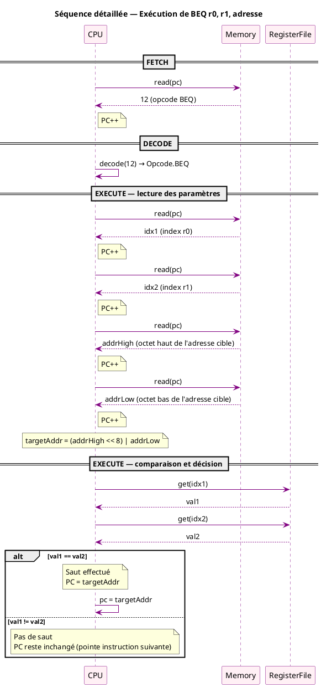

---

## Diagramme 9 — Diagramme d'états : Cycle de vie de l'exécution CPU

Ce diagramme montre les différents états par lesquels passe le CPU au fil de son exécution. Il est particulièrement utile pour comprendre le comportement global du simulateur, notamment les transitions entre le repos, l'exécution et les états d'erreur.

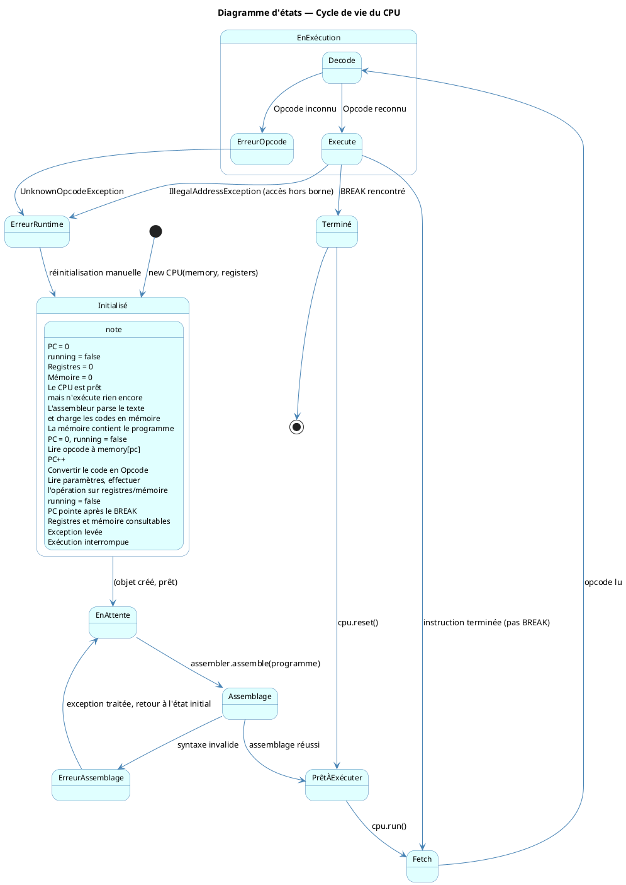

---

## Diagramme 10 — Diagramme de packages

Ce diagramme montre l'organisation des packages du projet et leurs dépendances. Il illustre la hiérarchie des couches et garantit qu'il n'y a pas de dépendances cycliques.

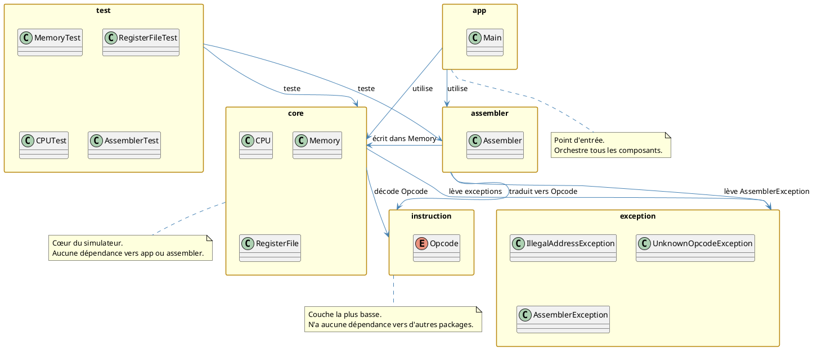

---

## Récapitulatif des diagrammes

Voici un tableau de synthèse des diagrammes produits et de leur rôle dans la notation :

| Numéro | Nom du diagramme | Type UML | Critère de notation couvert |
|--------|-----------------|----------|-----------------------------|
| 1 | Cas d'utilisation | Use Case | Diagramme des cas d'utilisation (5 pts) |
| 2 | Diagramme de classes | Class Diagram | Diagramme de classes (5 pts) |
| 3 | Séquence système — Exécution | Sequence (système) | Diagrammes de séquence système (5 pts) |
| 4 | Séquence système — Assemblage | Sequence (système) | Diagrammes de séquence système (5 pts) |
| 5 | Séquence détaillée — Cycle CPU | Sequence (détaillé) | Diagrammes de séquence détaillés (5 pts) |
| 6 | Séquence détaillée — Assembleur | Sequence (détaillé) | Diagrammes de séquence détaillés (5 pts) |
| 7 | Séquence détaillée — STORE | Sequence (détaillé) | Diagrammes de séquence détaillés (5 pts) |
| 8 | Séquence détaillée — BEQ | Sequence (détaillé) | Diagrammes de séquence détaillés (5 pts) |
| 9 | Diagramme d'états — CPU | State Machine | Complément conception |
| 10 | Diagramme de packages | Package Diagram | Modularité des classes (5 pts) |

---
---

# ═══════════════════════════════════════════════════════════
# VERSION V2 — DIAGRAMMES ÉQUILIBRÉS
# Arborescence corrigée · Niveau de détail intermédiaire
# ═══════════════════════════════════════════════════════════

> **Note V2 :** Cette section propose des diagrammes à un niveau de détail intermédiaire — techniquement complets (toutes les classes, méthodes clés, interactions importantes) mais sans les annotations de bas niveau qui surchargent la V1. L'arborescence reflète le vrai projet : `ALU.java` dans `core`, exceptions précises dans `exception`.

---

## V2 — Diagramme 1 : Cas d'utilisation

Deux acteurs sont représentés : l'Utilisateur (qui écrit et exécute des programmes) et JUnit (qui pilote les tests). Les cas d'utilisation couvrent les cinq étapes du projet, regroupés en packages fonctionnels, avec les relations `<<include>>` essentielles pour montrer les dépendances entre actions.

```
@startuml V2_CasUtilisation

skinparam actorStyle awesome
skinparam usecase {
  BackgroundColor #EEF4FB
  BorderColor #2E75B6
  ArrowColor #2E75B6
}
skinparam package {
  BorderColor #1F4E79
  BackgroundColor #F7FBFF
}

left to right direction

actor "Utilisateur" as U

rectangle "Simulateur CPU — Carré Petit Utile" {

  package "Assemblage" {
    usecase "Écrire un programme\nassembleur" as UC1
    usecase "Assembler le programme\n(traduit en codes numériques)" as UC2
    usecase "Charger le programme\nen mémoire" as UC3
  }

  package "Exécution CPU" {
    usecase "Lancer l'exécution" as UC4
    usecase "Exécuter LOAD / STORE" as UC5
    usecase "Exécuter opérations ALU\n(ADD, SUB, MUL, DIV, OR, AND, XOR)" as UC6
    usecase "Exécuter sauts\n(JUMP, BEQ, BNE)" as UC7
    usecase "Arrêter le CPU (BREAK)" as UC8
  }

  package "Consultation" {
    usecase "Consulter les registres" as UC9
    usecase "Consulter la mémoire" as UC10
  }

}

U --> UC1
UC1 ..> UC2 : <<include>>
UC2 ..> UC3 : <<include>>
U --> UC4
UC4 ..> UC5 : <<extend>>
UC4 ..> UC6 : <<extend>>
UC4 ..> UC7 : <<extend>>
UC4 ..> UC8 : <<include>>
U --> UC9
U --> UC10

@enduml
```

---

## V2 — Diagramme 2 : Diagramme de classes

Le diagramme de classes reflète l'arborescence réelle du projet. Toutes les classes sont présentes avec leurs attributs principaux et leurs méthodes clés. Les relations de composition, dépendance et héritage sont toutes indiquées. Les méthodes très internes (privatehelpers) sont omises pour ne pas noyer le lecteur.

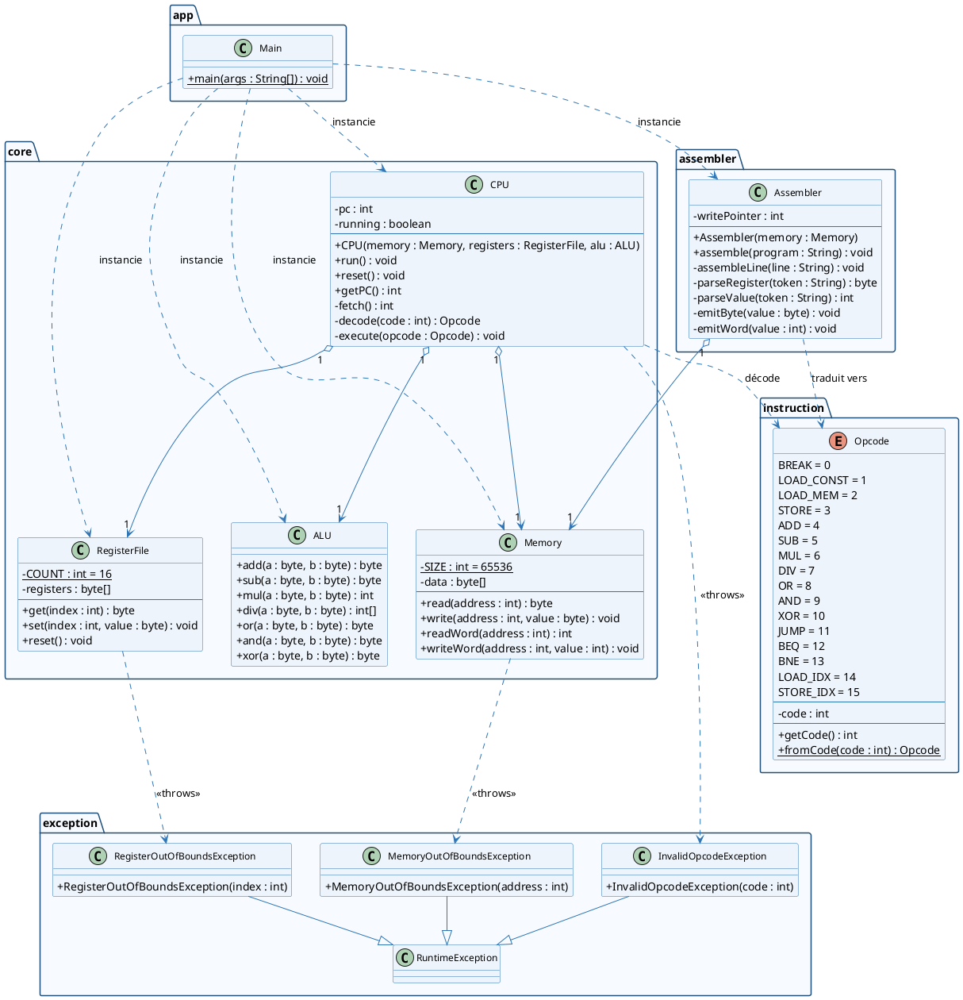

---

## V2 — Diagramme 3 : Séquence système — Exécution d'un programme

Ce diagramme montre les échanges entre l'utilisateur et le système vu comme une boîte noire. On distingue les deux grandes phases (assemblage puis exécution) et on montre le comportement en cas d'erreur, ce qui est important pour la notation.

```@startuml V2_SeqSysteme

skinparam sequenceMessageAlign center
skinparam sequence {
  ArrowColor #2E75B6
  LifeLineBorderColor #2E75B6
  ParticipantBackgroundColor #EEF4FB
  ParticipantBorderColor #2E75B6
}

actor "Utilisateur" as U
boundary "Système\n(CPU Simulateur)" as S

title Séquence système — Assemblage puis Exécution

== Phase 1 : Assemblage ==
U -> S : fournir le programme assembleur (texte)
activate S
  alt syntaxe valide
    S --> U : programme chargé en mémoire
  else erreur de syntaxe
    S --> U : AssemblerException (ligne N)
  end
deactivate S

== Phase 2 : Exécution ==
U -> S : lancer l'exécution du CPU
activate S
  loop jusqu'à BREAK
    S -> S : Fetch → Decode → Execute
  end
  alt exécution normale
    S --> U : exécution terminée
  else opcode invalide / accès mémoire hors borne
    S --> U : exception levée
  end
deactivate S

== Phase 3 : Consultation ==
U -> S : consulter l'état des registres
S --> U : valeurs des 16 registres

U -> S : consulter une zone mémoire
S --> U : contenu de la zone demandée

@enduml
```

---

## V2 — Diagramme 4 : Séquence détaillée — Cycle CPU complet (ADD r2, r0, r1)

Ce diagramme montre le cycle Fetch/Decode/Execute pour une instruction `ADD`. Les trois phases sont clairement séparées. La lecture des paramètres est montrée de façon groupée (trois lectures successives) sans répéter chaque `PC++` individuellement, ce qui allège sans perdre l'information essentielle.

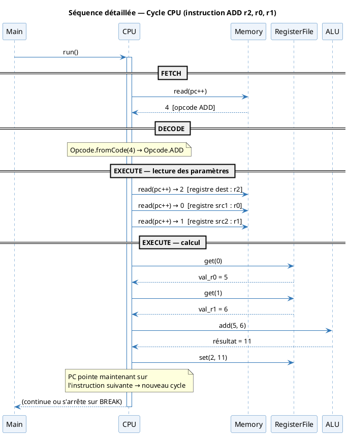

---

## V2 — Diagramme 5 : Séquence détaillée — Assembleur (load r2, @100 + break)

Ce diagramme montre comment l'assembleur traite deux lignes consécutives. Pour l'instruction `load r2, @100`, on voit le parsing, la reconnaissance du mode mémoire, et l'écriture des 4 octets en mémoire (opcode, registre, octet haut d'adresse, octet bas d'adresse). L'instruction `break` illustre le cas minimal.

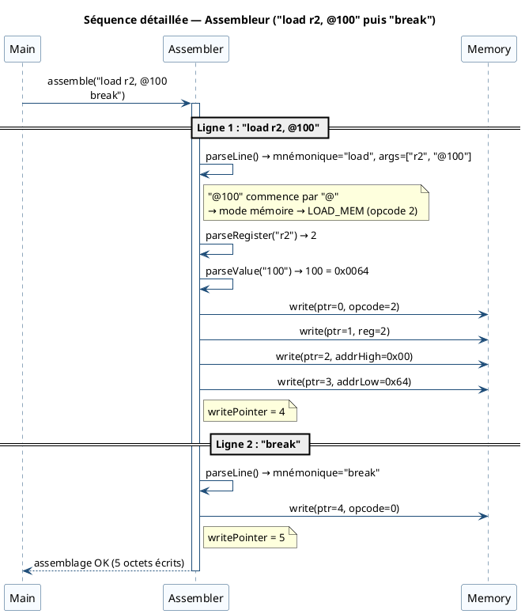

---

## V2 — Diagramme 6 : Séquence détaillée — Saut conditionnel BEQ

Ce diagramme illustre l'instruction `BEQ r0, r1, adresse`, fondamentale pour comprendre le mécanisme des boucles. On montre les deux cas possibles : le saut effectif (registres égaux) et la continuation normale (registres différents).

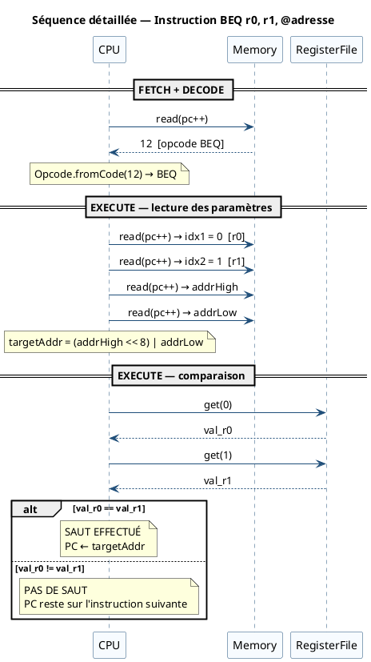

---

## V2 — Diagramme 7 : Diagramme d'états — Cycle de vie du CPU

Ce diagramme montre les états significatifs par lesquels passe le CPU. On distingue bien les états stables (Initialisé, Prêt, En exécution, Terminé) et les états d'erreur. Les transitions portent des libellés explicites qui indiquent quelle action ou quel événement les déclenche.

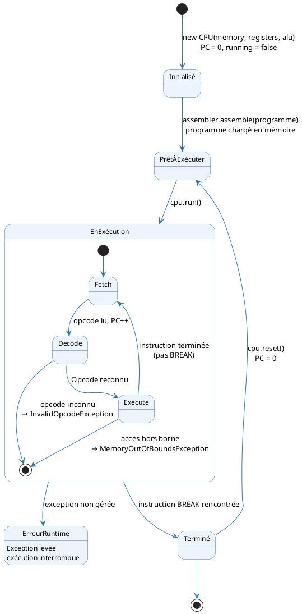

---

## Récapitulatif V2

| N° | Diagramme | Type UML | Critère de notation couvert |
|----|-----------|----------|-----------------------------|
| V2-1 | Cas d'utilisation | Use Case | Diagramme des cas d'utilisation (5 pts) |
| V2-2 | Diagramme de classes | Class Diagram | Diagramme de classes (5 pts) |
| V2-3 | Séquence système | Sequence (système) | Séquences système (5 pts) |
| V2-4 | Séquence détaillée — Cycle CPU ADD | Sequence (détaillé) | Séquences détaillées (5 pts) |
| V2-5 | Séquence détaillée — Assembleur | Sequence (détaillé) | Séquences détaillées (5 pts) |
| V2-6 | Séquence détaillée — BEQ | Sequence (détaillé) | Séquences détaillées (5 pts) |
| V2-7 | Diagramme d'états — CPU | State Machine | Complément conception |